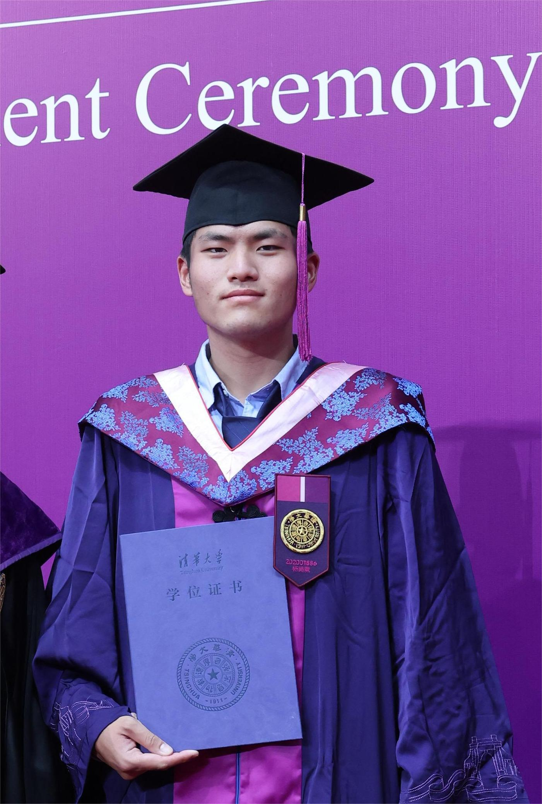

**Master Student** @ [Department of Statistics](https://stat.uchicago.edu/){:target="_blank"}, [University of Chicago](https://www.jaist.ac.jp/){:target="_blank"}  

**E-mail**: haolinyang2001 [at] uchicago.edu  
**Links**:

[GitHub](https://github.com/HLYang2001/){:target="_blank"} &nbsp;&nbsp;&nbsp; 
[Google Scholar](https://scholar.google.com/citations?user=UJWP-v0AAAAJ&hl=en){:target="_blank"} &nbsp;&nbsp;&nbsp; 
[ORCID](https://orcid.org/0009-0000-5904-3054){:target="_blank"} &nbsp;&nbsp;&nbsp; 
[CV](./assets/cv_hly.pdf){:target="_blank"} &nbsp;&nbsp;&nbsp;   

I am currently a master student in statistics at [the University of Chicago](https://www.uchicago.edu/en).  Previously I graduated from [Tsinghua University](https://www.tsinghua.edu.cn/en/) where I majored in English and minored in Economics & Finance and Statistics. My research focuses on using mathematically-sound and theoretically-inspired methods to understand the internal mechanisms of Large Language Models which underly their external behaviors, primarily __in-context learning__, and control their behaviors robustly and efficiently through such understanding. In my undergraduate days I also investigated the differences between the strategies applied by pretrained language models and those suggested by traditional translation studies to improve raw machine translations of English academic texts into Chinese. I have multiple papers accepted/submitted to top-tier international conferences including NeurIPS and ICLR.

I am actively seeking productive research collaborations in the aforementioned area or other related fields. If you are interested in working together, feel free to contact me. 

<strong style="color:red;">I am seeking Ph.D. positions starting in Fall 2026.</strong>

## Research Interests

**Keywords**: Mechanistic Interpretability, In-context Learning, Large Language Models

## Publications



### International Conferences



### Journals



### Pre-prints



<!-- ### <a title="(† = Japan-domestic Secondary Publication for Conference Papers; Default: Non-refereed,▲= Refereed)">Domestic Conferences / Miscellaneous</a> († = Japan-domestic Secondary Publication for International Conference Papers; Default: Non-refereed,▲= Refereed) -->

### Thesis

1. On Automatic Post-Editing Models in the English-Chinese Translation of Biomedical Journal Articles.   
   Haolin Yang  
   Outstanding Undergraduate Thesis @ [Tsinghua University](https://www.tsinghua.edu.cn/en/). **2024**. 80 pages.

## Resume

    
    

- **M.S.** in Statistics, 2024.9 ~ Now   
  [Department of Statistics](https://stat.uchicago.edu/){:target="_blank"}, [University of Chicago](https://www.uchicago.edu/en){:target="_blank"}   
  
- **B.A.** in English, 2020.9 ~ 2024.6  
  [Department of Foreign Languages and Literatures](https://www.dfll.tsinghua.edu.cn/dfllen/), [Tsinghua University](https://www.tsinghua.edu.cn/en/){:target="_blank"}   

  **Minor** in Economics and Finance, 2020.9 ~ 2024.6  
  [School of Economics and Management](https://www.sem.tsinghua.edu.cn/en/), [Tsinghua University](https://www.tsinghua.edu.cn/en/){:target="_blank"}   

## Awards
- Outstanding Undergraduate Thesis @ School of Humanities, Tsinghua University. 2024. 
- Outstanding Undergraduate @ Tsinghua University. 2024.
- Academic Execellence Scholarship @ Tsinghua University. 2022-2023.